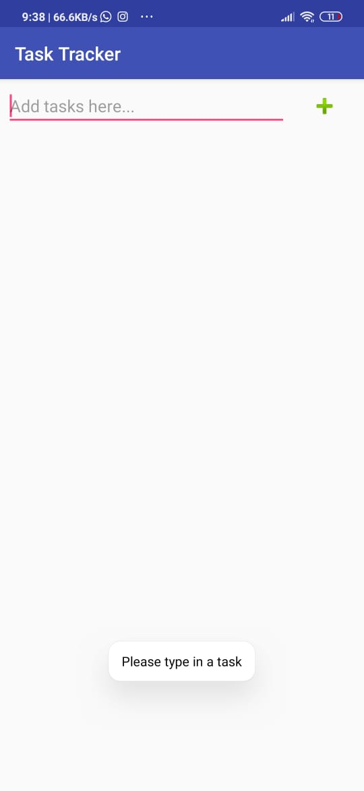

# TaskTracker
<!--<h1>Task Tracker</h1>-->
A persistent task management application built in android with Kotlin. 

</img>
</img>
</img>

 
The application used shared preferences to keep track of tasks across sessions.The tasks can be added or removed by the user and are rendered onto a ListView using a custom adapter.
Kotlin is the main language of the application.